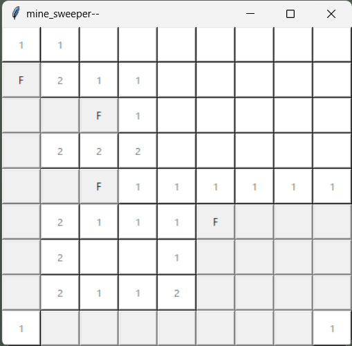

# mine_sweeper_py



## About this code

This code is my Python programming practice.

## CLI game

```bash
python mine_sweeper.py
```

## GUI game

```bash
python mine_sweeper_gui.py
```

## Impression about Python

みんな大好きPython。

型、アクセス権限などほとんど考える事がなく、インタプリタ言語なので、エラー発生時のデバッグも楽。

ブロックに括弧を使わないので、行数が少なく見通しが良い。

デフォルトの組込みの機能が豊富。GUIでさえ組込みで書ける。

実行環境の配布は面倒で、PyInstaller はバッドノウハウの塊になる。

普通のオブジェクト指向言語なので継承とかは普通に書ける。動的型判定ができるのが嬉しい。

```python
if isinstance(panel, BombPanel):
    some_process()
else:
    another_process()
```

`isinstance` が組込み関数である都合上、条件文がちょっと左から右に読み進めづらい気がしたので  `is_instance_of()` とか作ってみた

```python
if panel.is_instance_of(BombPanel):
    some_process()
else:
    another_process()
```

まあそういう事もできるかなという程度。MineSweeper のケースに限って言えば `is_bomb()` を作るのと手間は変わらないかも。

for 文と range の組み合わせは、一定範囲のインデックスを探索したい時などにちょっとダサくなることがある

```python
for row in range(y - 1, y + 2):
    for col in range(x - 1, x + 2):
```

気にするほどでもないか。
